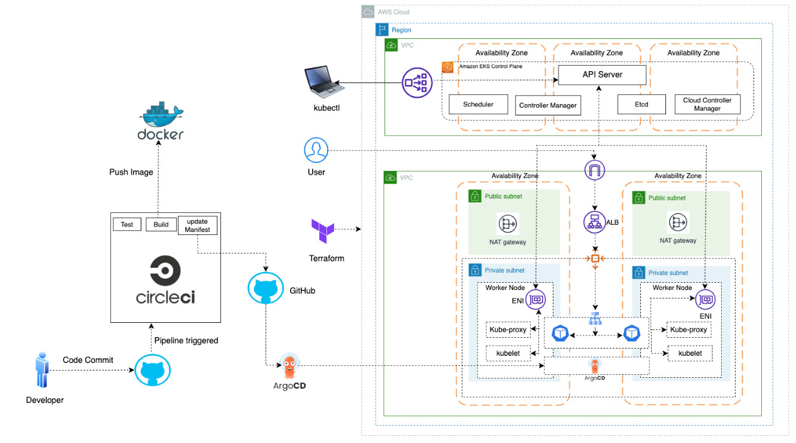

# 🚀 EKS GitOps Automation Platform

A production-ready CI/CD platform showcasing Infrastructure as Code, GitOps principles, and cloud-native DevOps practices on AWS EKS.

## 📺 Demo Video

To be updated

---

## 🏗️ Architecture

## 📖 Project Overview

This project implements a **complete end-to-end GitOps workflow** for deploying containerized applications on AWS EKS. It demonstrates modern DevOps practices by automating the entire journey from code commit to production deployment.

### **End-to-End Workflow:**

From code commit to production deployment in minutes:
1. **Builds** a Docker image with multi-stage optimization
2. **Pushes** the image to Docker Hub with semantic versioning
3. **Updates** Kubernetes manifests in a separate GitOps repository
4. **Deploys** automatically to EKS via ArgoCD synchronization
5. **Monitors** and self-heals the application continuously

All infrastructure is provisioned as code using Terraform, making the entire stack reproducible and version-controlled.

### **Technologies & DevOps Practices Demonstrated:**

#### **Infrastructure as Code (Terraform)**
- 100% reproducible infrastructure across environments
- Version-controlled configuration with S3 backend and DynamoDB locking
- Modular design using official AWS Terraform modules
- Declarative infrastructure definition

#### **GitOps (ArgoCD)**
- Git as the single source of truth for application and infrastructure state
- Automated synchronization with continuous reconciliation
- Self-healing capabilities - automatically reverts manual changes
- Complete audit trail with rollback to any previous version

#### **Container Orchestration (Kubernetes & EKS)**
- Automated deployment, scaling, and management of containerized applications
- Rolling updates for zero-downtime deployments
- Self-healing through ReplicaSets and health checks
- RBAC and IAM integration for security

#### **CI/CD Automation (CircleCI & Docker)**
- Automated build, test, and deployment pipelines
- Multi-stage Docker builds for optimized image sizes
- Semantic versioning for images with automated tagging
- Automated Kubernetes manifest updates

#### **Cloud-Native Architecture (AWS)**
- Leverages AWS-managed services (EKS, ALB, VPC, S3, DynamoDB)
- Multi-AZ deployment for high availability and fault tolerance
- Application Load Balancer for automatic traffic distribution
- Secure architecture with private subnets and IAM-based access control

---

