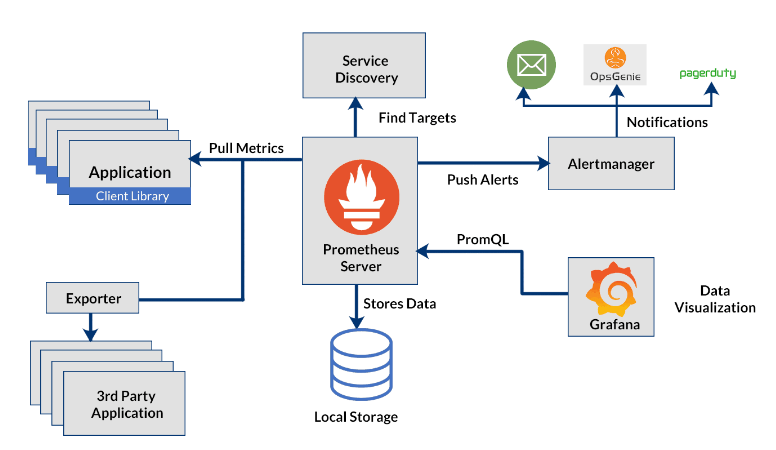

# 📊 Kubernetes Cluster Automated Monitoring with Prometheus & Grafana

A production-ready observability platform showcasing comprehensive monitoring, alerting, and visualization for microservices on AWS EKS using Prometheus, Grafana, and cloud-native best practices.

## 📺 Demo Video

To be updated

## 🏗️ Architecture

The project implements a complete observability stack following the Prometheus monitoring pattern:

- **Applications** with instrumented metrics endpoints
- **Prometheus Server** for metrics collection and storage with service discovery
- **Alertmanager** for intelligent alert routing and notification management
- **Grafana** for rich visualization and dashboard creation
- **Kube State Metrics** for Kubernetes object state monitoring
- **Node Exporter** for hardware and OS-level metrics

## 📖 Project Overview

This project implements a **comprehensive monitoring and observability platform** for microservices running on AWS EKS. It demonstrates modern SRE practices by providing complete visibility into application health, performance, and availability through automated monitoring, intelligent alerting, and rich visualization.

### **End-to-End Workflow:**

Complete observability with sub-minute Mean Time to Detect (MTTD):

1. **Discovers** microservices automatically using Kubernetes service discovery
2. **Collects** metrics from application pods, nodes, and Kubernetes API
3. **Stores** time-series data with configurable retention policies
4. **Evaluates** alert rules continuously against collected metrics
5. **Triggers** alerts when thresholds are breached
6. **Routes** notifications to appropriate channels (Slack, Email, PagerDuty)
7. **Visualizes** metrics through pre-built and custom Grafana dashboards
8. **Enables** troubleshooting with query-based metric exploration

All monitoring infrastructure is deployed using Helm charts with GitOps-ready configurations, making the entire stack reproducible and version-controlled.

### **Technologies & DevOps Practices Demonstrated:**

#### **Observability (Prometheus & Grafana)**
- Cloud-native monitoring with pull-based metric collection
- Service discovery for dynamic microservice environments
- PromQL for powerful metric querying and aggregation
- Rich visualization with pre-built and custom dashboards
- Historical data analysis with configurable retention

#### **Intelligent Alerting (Alertmanager & PrometheusRules)**
- Rule-based alerting with flexible expressions
- Multi-severity alert classification (Critical, Warning, Info)
- Alert grouping, throttling, and deduplication
- Notification routing to multiple channels (Slack, Email, OpsGenie, PagerDuty)
- Self-healing awareness through Watchdog alerts

#### **Kubernetes-Native Monitoring**
- Pod-based health monitoring using deployment metrics
- gRPC and HTTP service compatibility
- Automatic handling of pod restarts and crashes
- CrashLoopBackOff detection
- Resource utilization tracking (CPU, Memory, Network)

#### **Cloud-Native Architecture (AWS EKS)**
- Fully managed Kubernetes control plane
- EKS-optimized monitoring
- LoadBalancer services for external access via AWS ELB
- Multi-AZ deployment for high availability
- IAM-based security with proper RBAC

#### **Infrastructure as Code**
- Helm-based deployment for reproducibility
- Version-controlled monitoring configurations
- Declarative alert rules and recording rules
- GitOps-ready manifest structure
